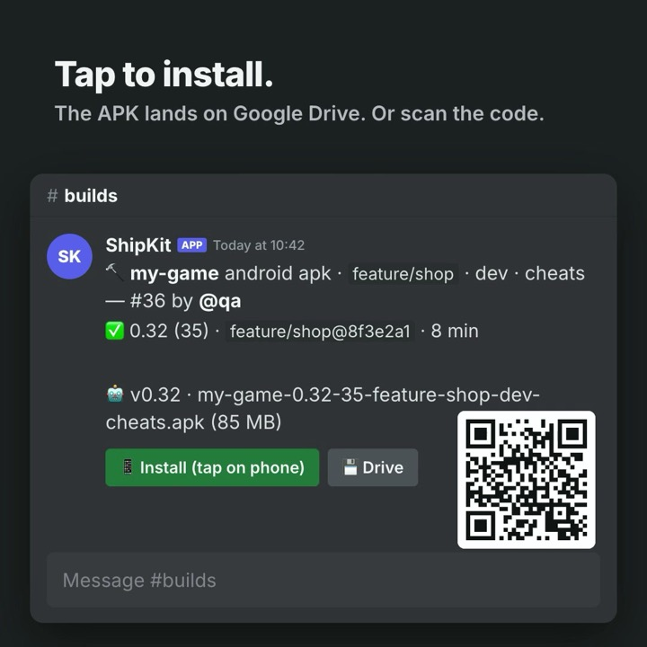

# unity-ship-kit

**Your own Unity Cloud Build, on a Mac you already have.** Someone types `/build` in Discord. A few minutes later there's an Android APK to install (tap the link or scan the QR code), or the build is on TestFlight for iPhone. No build server to rent and no minutes to pay for.

<p align="center"></p>

- 🛠️ **Build any branch** from Discord: Android APK/AAB or iOS, with dev build and cheat menu toggles.
- 📱 **Install in one tap.** APKs land on Google Drive with an Install link and a QR code. iOS goes to TestFlight.
- 🌙 **Nightly QA builds** of every game, skipped when nothing changed.
- 🔢 **Build numbers that never clash**, checked against Google Play and TestFlight.
- 📤 **Upload to Google Play** (internal track) with one button, optional.
- 🧵 **Clear failures:** the reason in the message, the error lines and full log in a thread.
- 💻 **Doesn't get in the way.** Builds run in the background in their own copy of the game, so the Mac can be someone's work computer.

Made by Luka Pikula at [Oox](https://ooxlimited.com/). MIT licensed.

**Contents:** [Setup](#setup-step-by-step) · [Using the bot](#for-qa-using-the-bot) · [FAQ](#faq) · [How it works](#for-devs-how-it-works) · [Errors](#error-categories) · [Security](#security-model)

## Setup, step by step

Plan on about an hour the first time. Most of it is clicking through the Discord, Google and Apple websites and copying values into **one file, `config.env`**. You don't need to read any code.

**Stuck?** Run `./setup.sh`. It checks everything and tells you what's still missing. Then look in [TROUBLESHOOTING.md](TROUBLESHOOTING.md), or [open an issue](https://github.com/Kumici13/unity-ship-kit/issues).

### Faster: let an AI set it up with you

Using [Claude Code](https://claude.com/claude-code) or another AI coding assistant that can run Terminal commands? Open it in an empty folder and paste this:

```text
Help me set up unity-ship-kit (https://github.com/Kumici13/unity-ship-kit) on this Mac.
Clone it into ~/unity-ship-kit, read its README.md, then follow "Setup, step by step" with me.

- Ask me first which platforms I build (Android, iOS or both), whether I want Play upload,
  and whether builds should go to a normal Google Drive or a Workspace Shared Drive.
  Skip the steps I don't need.
- Run the Terminal steps yourself. For website steps (Discord, Google, Apple), tell me exactly
  what to click, one step at a time, and wait until I paste back the value you need.
- Write the values into config.env and projects.json yourself. Never print, commit or upload
  secrets (tokens, passwords, keys), and never change files inside my game repos.
- For projects.json, read each game's ProjectSettings/ProjectSettings.asset to find its package
  name and bundle ID, and ask me about anything you can't find.
- Run ./setup.sh after each step and fix what it reports. When it says
  "All required checks passed.", run ./setup.sh --install and tell me to type /build in Discord.
```

### Before you start: what you need

| | You need |
|---|---|
| ✅ Always | A **Mac** (Apple silicon or Intel) that stays on. It can be the Mac someone works on every day: builds run in the background |
| ✅ Always | **Unity 6** games in **GitHub** repos, and a Unity account (Unity Personal is fine) |
| ✅ Always | A **Discord server** where you're allowed to add a bot |
| 🤖 Android | A **Google account** for the build links: a normal Gmail works, or a Google Workspace Shared Drive |
| 🤖 Android | The game's **keystore** (the `.keystore` file that signs it) and its passwords |
| 🤖 Android, optional | A **Google Play developer account**, only for the 📤 Upload to Play button |
| 🍏 iOS, optional | **Xcode** and an **Apple Developer account** (Account Holder or Admin). iOS builds go to TestFlight, so skip this if you only need Android |

Only iOS games? Skip everything Google. Only Android games? Skip everything Apple. No Play upload? Skip the Play parts.

**macOS only.** Tested on macOS 26 with Xcode 26 and Unity 6 (6000.0.x). Doesn't run on Windows or Linux.

### Step 1: Install the tools

Open **Terminal** (press ⌘ Space, type `Terminal`, press Enter) and paste these one at a time.

1. **Homebrew** (installs the other tools). Skip if `brew -v` already works. Follow the "Next steps" it prints at the end.
   ```bash
   /bin/bash -c "$(curl -fsSL https://raw.githubusercontent.com/Homebrew/install/HEAD/install.sh)"
   ```
2. **Python and Git LFS:**
   ```bash
   brew install python git-lfs && git lfs install
   ```
3. **Unity Hub**: download it from https://unity.com/download, open it and **sign in**. Under **Settings → Licenses**, make sure you have an active license (Unity Personal is fine). The bot uses this license. You don't need to install Unity editors: the bot installs the version each game needs.
4. **Unity command line** (the bot uses it to install editors):
   ```bash
   curl -fsSL https://public-cdn.cloud.unity3d.com/hub/prod/cli/install.sh | UNITY_CLI_CHANNEL=beta bash
   ```
5. **iOS games only:** install **Xcode** from the Mac App Store and open it once to accept the license.
6. **Your games on this Mac.** The bot needs a copy of each game repo to know where it lives on GitHub. If your games aren't on this Mac yet:
   ```bash
   mkdir -p ~/Documents/GitHub && cd ~/Documents/GitHub
   git clone https://github.com/<you>/<your-game>.git
   ```
   If that asks for a password and fails, set up GitHub sign-in first. The easiest way is `brew install gh && gh auth login`, answering the questions with the defaults.

### Step 2: Download ShipKit

```bash
cd ~ && git clone https://github.com/Kumici13/unity-ship-kit.git && cd unity-ship-kit
./setup.sh
```

The first run creates two files for you to fill in:
- **`config.env`**: passwords and IDs. Open it with `open -e config.env`. Each line is `NAME=value`: paste the value right after `=`, with no spaces and no quotes. Lines starting with `#` are notes.
- **`projects.json`**: your games (Step 7).

Many ❌ are normal at this point. The next steps fix them one by one.

### Step 3: Discord bot

1. Go to https://discord.com/developers/applications → **New Application** → name it (e.g. ShipKit).
2. Left menu **Bot** → **Reset Token** → **Copy**. In `config.env`: `DISCORD_TOKEN=<paste>`. Keep it secret: it's the bot's password.
3. Left menu **General Information** → copy the **Application ID**. Put it in this link instead of `<APPLICATION_ID>`, open the link and pick your server:
   `https://discord.com/oauth2/authorize?client_id=<APPLICATION_ID>&scope=bot+applications.commands&permissions=309237763072`
4. In the Discord app: **User Settings → Advanced → Developer Mode** on. Now right-clicking things shows **Copy … ID**:
   - Right-click your **server icon** → **Copy Server ID** → `DISCORD_GUILD_ID=`
   - Make a channel for builds (e.g. `#builds`), right-click it → **Copy Channel ID** → `BUILD_CHANNEL_ID=`
   - Optional: right-click **yourself** → **Copy User ID** → `OWNER_DISCORD_ID=` (you get a ping when a build starts while that game is open on your Mac).
   - Optional: right-click a **role** (Server Settings → Roles) → **Copy Role ID** → `ALLOWED_ROLE_ID=` (only people with that role can build) and `UPLOAD_ROLE_ID=` (only they can upload to Play).

### Step 4: Google (Android games only)

**4.1 A Google Cloud project** (free; needs no billing):
1. Go to https://console.cloud.google.com → top bar project picker → **New project** → any name → **Create**. Make sure it's selected in the top bar.
2. **☰ → APIs & Services → Library** → search **Google Drive API** → **Enable**. Using Play upload? Also enable **Google Play Android Developer API**.

**4.2 A robot account for Google Play** (a "service account"). **Optional** with a normal Drive (4.3a): skip it if you don't need the 📤 Upload to Play button. Needed for a Shared Drive (4.3b).
1. **☰ → IAM & Admin → Service Accounts → Create service account** → any name → **Done** (skip the optional roles).
2. Click it → **Keys → Add key → Create new key → JSON**. A file downloads. Move it somewhere safe:
   ```bash
   mkdir -p ~/.config/shipkit && mv ~/Downloads/<the-file>.json ~/.config/shipkit/service-account.json && chmod 600 ~/.config/shipkit/service-account.json
   ```
   In `config.env`: `PLAY_SERVICE_ACCOUNT=~/.config/shipkit/service-account.json`
3. Copy the service account's email (looks like `name@project.iam.gserviceaccount.com`).
4. Using Play upload: https://play.google.com/console → **Users and permissions → Invite new users** → paste that email → under **App permissions** add your games → tick **Release to testing tracks** → **Invite user**.

**4.3 Where the builds go.** Pick **a** or **b**.

**a) Normal Google Drive** (any Gmail, 15 GB free). Builds go into a "ShipKit builds" folder. The bot can only see files it made itself, nothing else in your Drive.
1. In Cloud Console: **☰ → Google Auth Platform** → **Get started**. App name: ShipKit. Support email: yours. Audience: **External**. Contact email: yours. Agree → **Create**.
2. **Audience** → **Publish app** → **Confirm** (status **In production**). Skip this and Google logs the bot out every 7 days.
3. **Clients → Create client** → Application type **Desktop app** → **Create** → **Download JSON**.
4. In Terminal, in the `unity-ship-kit` folder:
   ```bash
   python3 tools/drive_login.py ~/Downloads/client_secret_<…>.json
   ```
   A browser opens. Sign in with the Google account whose Drive should hold the builds. Google warns **"Google hasn't verified this app"**: that's normal, because it's your own app. Click **Advanced → Go to ShipKit (unsafe)** → **Continue**. When the terminal says `Saved`, you're done.
5. In `config.env`: `DRIVE_MODE=personal`

Builds older than 30 days are deleted automatically so the Drive doesn't fill up. If Google ever logs the bot out (for example after a password change), run step 4 again.

**b) Google Workspace Shared Drive** (if your studio uses Workspace):
1. https://drive.google.com → **Shared drives → New** → name it e.g. "Builds".
2. **Manage members** → add the service account email from 4.2 → **Content manager**.
3. Open the drive. The link looks like `drive.google.com/drive/folders/<ID>`. Copy the `<ID>` part → `DRIVE_SHARED_DRIVE_ID=`
4. Testers use personal Gmail accounts? A Workspace admin must allow sharing outside the organization for shared drives (admin.google.com → Apps → Google Workspace → Drive and Docs → Sharing settings). Or keep links inside your company: `DRIVE_SHARING=domain` and `DRIVE_DOMAIN=yourstudio.com`.

### Step 5: Android signing key (Android games only)

Use the keystore your game already ships with. The key that signs a game's first Play upload stays its upload key.

In `config.env`:
```
KEYSTORE_MAIN_PATH=/Users/<you>/keys/my-game.keystore
KEYSTORE_MAIN_PASS=<keystore password>
```
Add `KEYSTORE_MAIN_ALIASPASS=` only if the key password is different. To see the key name (alias) inside it: `keytool -list -keystore <path>`. Games signed with different keystores get one set each: `KEYSTORE_OTHER_PATH` / `KEYSTORE_OTHER_PASS`, then `"keystore": "other"` in projects.json.

No keystore yet (brand-new game)? Make one and **back it up with its passwords**, because a lost keystore means a painful key reset with Google:
```bash
mkdir -p ~/keys && keytool -genkeypair -v -keystore ~/keys/my-game.keystore -alias upload -keyalg RSA -keysize 2048 -validity 10000
```

### Step 6: Apple (optional, iOS games only)

1. https://appstoreconnect.apple.com → **Users and Access → Integrations → App Store Connect API → Team Keys → +** → any name, access **App Manager** → **Generate**.
2. **Download API Key** (Apple lets you download it only once) and move it:
   ```bash
   mkdir -p ~/.appstoreconnect/private_keys && mv ~/Downloads/AuthKey_*.p8 ~/.appstoreconnect/private_keys/
   ```
3. In `config.env`: `ASC_KEY_ID=` the Key ID from the list, `ASC_ISSUER_ID=` the Issuer ID shown above the list, and `ASC_KEY_PATH=~/.appstoreconnect/private_keys/AuthKey_<KEY_ID>.p8`
4. `TEAM_ID=`: https://developer.apple.com/account → **Membership details → Team ID**.
5. **Xcode → Settings → Accounts → +** → sign in with an Apple ID that is **Account Holder or Admin** on the team. Then **Manage Certificates → + → Apple Distribution**.
6. Each game must exist in App Store Connect (**Apps → +**) with the same bundle ID you put in `projects.json`.

### Step 7: Tell it about your games

Open `projects.json` (`open -e projects.json`) and replace the two example games with yours:

```json
{
  "my-game": {
    "repo_path": "~/Documents/GitHub/my-game",
    "branch": "main",
    "package_name": "com.mystudio.mygame",
    "keystore": "main",
    "key_alias": "upload",
    "cheat_defines": ["CHEATS"],
    "platforms": ["android"]
  }
}
```

- `"my-game"`: the name you'll pick in Discord.
- `repo_path`: where the game is on this Mac (Step 1.6). `branch`: its main branch.
- `package_name`: Unity → **Project Settings → Player → Android → Identification → Package Name**.
- `keystore` / `key_alias`: from Step 5.
- `cheat_defines`: the scripting define your cheat menu hides behind (`#if CHEATS`). Leave `[]` if you have none.
- `platforms`: `["android"]`, `["ios"]` or `["android", "ios"]`. For iOS also add `"bundle_id": "com.mystudio.mygame"`.

More than one game? Add another block after a comma. Every option: [Adding a game](#adding-a-game).

### Step 8: Check and start

```bash
./setup.sh              # repeat until it says "All required checks passed."
./setup.sh --install    # starts the bot now and every time you log in
```

Your bot now shows as online in Discord. In your build channel type `/build`, pick your game and press Enter. **The first build of a game takes 10–30 minutes** (it downloads Unity and imports every asset). After that, a few minutes.

To keep it running when you're away (reboots, power cuts, sleep), see [Power loss, reboots, sleep](#power-loss-reboots-sleep). Before letting other people use it, read the [Security model](#security-model).

---

## For QA: using the bot

All commands work only in the build channel. Anyone who can see the channel can use every command.

### `/build`: build a game

```
/build game:my-game
/build game:my-game cheats:True
/build game:my-game branch:feature/new-shop dev:True note:"shop fix"
/build game:other-game platform:both format:aab
```

| Option | Default | What it does |
|---|---|---|
| `game` | (required) | Pick from the list |
| `platform` | `android` | `android`, `ios` or `both` |
| `format` | `apk` | `apk` installs directly on a phone; `aab` is only for the Play Store |
| `branch` | game's main branch | Autocompletes from GitHub, most recently changed first |
| `dev` | off | Development build (profiler, debug logs) |
| `cheats` | off | Turns on the game's cheat/debug menu |
| `note` | none | Short label shown in the message and the file name |
| `clean` | off | Wipes the import cache first. Slow; only use it when a build is broken for no reason |
| `force` | off | Rebuild even if this exact commit was already built |

**What you'll see:** one message that updates itself.

```
🔨 my-game android apk · master · cheats — #12 by @you
⚙️ Unity Android: IL2CPP (slowest step) (3 min) · ~2 min left
```

When it finishes:

```
✅ 0.31 (28) · master@a897756f · 4 min
🤖 v0.31 · my-game-0.31-28-master-cheats.apk (85 MB)
📝 3 new commit(s) since last build:
• Fix tutorial save (Alice)
• Cargo drop animation (Bob)
[📱 Install] [💾 Drive] [🔁 Rebuild]   + QR code
```

- **📱 Install**: tap it on an Android phone; the APK downloads, then tap it to install. The first time, Android asks you to allow installs from your browser.
- **QR code**: scan it with your phone camera when you're on a PC. Same thing as Install.
- **💾 Drive**: normal Google Drive page, for downloading on a PC.
- **🔁 Rebuild**: same settings, latest commit.
- **📤 Upload to Play (internal)**: only on `format:aab` release builds (no dev, no cheats), because Play doesn't accept APKs. Sends that exact bundle to the Play Console internal track as a draft.

**If nothing changed since the last build**, the bot doesn't build again. It reposts the existing build (♻️) in about 2 seconds. Use `force:True` if you really need a fresh one.

**If it fails**, the message shows ❌ and the reason, and a thread opens under it with the error and the full log attached.

### Other commands

| Command | What it does |
|---|---|
| `/latest game:<game>` | Newest finished build (buttons + QR), visible only to you |
| `/status` | What's building, what's queued, free disk space |
| `/builds` | Last 10 builds with links |
| `/abort` | Stop the build that's running |
| `/cancel` | Remove a queued build |

### Good to know

- **One build at a time.** Others wait in a queue and show their position. The queue survives bot restarts.
- **Build numbers are unique per game** and always go up, even for builds that never reach a store. Two APKs never share a number, so "build 215" always means one specific build.
- **The first build of a game is slow** (10–30 min: it clones the repo and imports all assets). After that, builds take a few minutes.
- **Only pushed commits are built.** The bot builds what's on GitHub, never someone's local changes.
- **Release builds are made Play-safe.** If a game's custom `AndroidManifest.xml` hard-codes `android:debuggable="true"`, the bot removes it in its build copy for release builds, and verification rejects anything still debuggable. Dev builds stay debuggable.
- **iOS** goes straight to TestFlight (internal testers). The message shows processing, then ready. There's no Drive link for iOS.
- **Nightly:** every night at 03:00, each game's main branch gets a **QA build**: dev + cheats APK, plus a TestFlight build for games with iOS set up. Games with no new commits since the last nightly are skipped. Messages say "by 🌙 nightly".

---

## FAQ

**Does it work on Windows or Linux?** No. It needs macOS: iOS builds need Xcode, and the bot runs as a macOS background service. Android-only studios still need a Mac for now.

**Will it slow down my Mac while I work?** Builds run at low priority in a separate copy of the game, so your open Unity project and files are never touched. A build still uses a lot of CPU for a few minutes; you'll notice it in heavy tasks, not in normal work.

**How much disk space?** About 100 GB with several games, mostly Unity's import cache. Each game's first build creates it; later builds reuse it. `/status` shows free space.

**Where do builds go, and for how long?** Android: Google Drive, deleted after 30 days. iOS: TestFlight (Apple keeps them 90 days). The last builds are also in `~/ShipKit/artifacts` on the Mac for 30 days.

**Who can download a build?** By default anyone with the link, so testers can use personal Gmail accounts. For unreleased games you can limit links to your company domain: `DRIVE_SHARING=domain`.

**Does it change my game repos?** Never. It builds from its own clone of what's pushed to GitHub. Version numbers, cheat defines and signing are applied only inside the build.

**Does the Mac need to stay on?** Yes, and logged in. [Power loss, reboots, sleep](#power-loss-reboots-sleep) lists the settings that make it come back by itself after a power cut.

**Something failed. Now what?** Read the ❌ reason and the thread under the message, then [Error categories](#error-categories) and [TROUBLESHOOTING.md](TROUBLESHOOTING.md). With [Claude Code](https://claude.com/claude-code), the included `nightly-triage` skill reviews failed builds for you.

---

## For devs: how it works

```
Discord /build ─► bot.py ─ queue (~/ShipKit/builds.json)
                     │
                     └─► pipeline.py build   (caffeinate + nice, own process group)
                           1. clone/fetch ~/ShipKit/work/<game>, reset to origin/<branch>
                              (only Library/ survives between builds)
                           2. build number = max(Play/TestFlight, last issued, repo) + 1
                           3. unity build (Unity CLI) → ShipKit.Android / ShipKit.IOS
                           4. Android: verify AAB → universal APK → Drive (anyone with link)
                              iOS:     xcodebuild archive → TestFlight → wait for processing
                           5. prints @@RESULT {...} → bot edits the Discord message
```

- **Game repos in `~/Documents/GitHub` are never modified.** They're only read for their GitHub URL and for `extra_files`. If your editor has the game open, the build still runs (separate clone); the owner just gets an FYI ping.
- **Unity version** comes from each project's `ProjectVersion.txt`. The Unity CLI installs a missing editor, and `pipeline.py` adds missing Android/iOS modules.
- **Version changes are never committed back.** Version, build number, cheat defines and signing are set only inside the batch Unity process.

### Files

| File | Purpose |
|---|---|
| `bot.py` | Discord bot: commands, queue, messages, buttons, nightly + cleanup timers |
| `pipeline.py` | One job: clone → number → Unity → verify → Drive / TestFlight. Also `upload` (Play) and `prune` (Drive cleanup) |
| `ship_android.py` | Play API, AAB verification, APK from AAB. Also usable directly from the CLI (below) |
| `ship.py` | Shared helpers (config, logging, git, ASC API) + legacy single-project iOS CLI |
| `setup.sh` | First-time setup + health check (`--install` starts the bot) |
| `requirements.txt` | Python packages |
| `projects.json` | The games (see below; start from `projects.example.json`) |
| `tools/nightly_report.py` | One-screen summary of recent builds and why they failed |
| `tools/drive_login.py` | One-time Google sign-in for `DRIVE_MODE=personal` (builds on a normal Google Drive) |
| `.claude/skills/nightly-triage` | [Claude Code](https://claude.com/claude-code) skill: review failed builds, fix, verify with a rebuild |
| `unity-side/ShipKit.cs` | Build entry points, copied into each clone per build. Never commit it into a game repo |
| `unity-side/BuildScript.cs` | Legacy entry point for `ship.py` |
| `launchd/com.shipkit.bot.plist` | Keeps the bot running (login + crash restart) |
| `config.env` | Secrets and IDs. **Gitignored, never commit.** Template: `config.env.example` |

State on the Mac (not in git): `~/ShipKit/` holds `work/` (clones), `artifacts/<build id>/` (AAB/APK, kept 30 days), `logs/<build id>.log`, `builds.json` (queue + history) and `counters.json` (build numbers).

### Adding a game

Add an entry to `projects.json` (first time: `cp projects.example.json projects.json`). The bot reads it live, so no restart is needed.

```json
"my-game": {
  "repo_path": "~/Documents/GitHub/my-game",
  "branch": "main",
  "package_name": "com.example.mygame",
  "keystore": "main",
  "key_alias": "my key",
  "cheat_defines": ["CHEATS"],
  "platforms": ["android"]
}
```

| Key | Required | Notes |
|---|---|---|
| `repo_path` | ✓ | Local clone; the build clone is made from its `origin` URL |
| `branch` | ✓ | Default branch for `/build` and nightly |
| `package_name` | ✓ | Android application ID |
| `keystore` / `key_alias` | ✓ | `keystore: "main"` → `KEYSTORE_MAIN_PATH/PASS` in config.env. List aliases: `keytool -list -keystore <path>` |
| `cheat_defines` | for `cheats:True` | Scripting defines the game's cheat menu is behind (`#if CHEATS`) |
| `platforms` | | Default `["android","ios"]` |
| `bundle_id` | for iOS | iOS bundle ID (must exist in App Store Connect) |
| `team_id`, `asc_prefix` | | App under another Apple team: `"asc_prefix": "CLIENT"` → `CLIENT_KEY_ID/ISSUER_ID/KEY_PATH` |
| `self_bumping` | | Project's own build preprocessor bumps version +0.01 and code +1; the bot compensates. Needs an `X.YY` version |
| `target_sdk` | | Android targetSdk (default 36; Play requires 35+) |
| `extra_files` | | Gitignored files the build needs, copied from `repo_path` (e.g. `Assets/google-services.json`) |
| `prebuild_method` | | Static C# method run before the player build (e.g. an Addressables build) |
| `nightly` | | `false` to skip nightly builds (default: dev + cheats APK, and iOS when `bundle_id` is set) |
| `ios_min_version` | | Minimum iOS for this game (default `IOS_MIN_VERSION`, 15.0) |
| `uses_encryption` | | `true` if the game ships its own crypto: never declared exempt, even with `IOS_EXEMPT_ENCRYPTION=true` |

**Before the first Play upload of a new app,** decide its upload key. Whatever key signs the first upload becomes its upload key (Play Console → App signing → Upload key certificate). With Play App Signing that's recoverable through Play support, but pick on purpose.

### Operating it

```bash
launchctl kickstart -k gui/$(id -u)/com.shipkit.bot   # restart (after editing bot.py)
launchctl bootout gui/$(id -u)/com.shipkit.bot        # stop
tail -f ~/Library/Logs/shipbot.log                    # bot log
tail -f ~/ShipKit/logs/<build id>.log                 # one build's log
```

### Power loss, reboots, sleep

| Setting | Why |
|---|---|
| `pmset autorestart 1` (on) | Mac boots by itself after a power cut |
| **Automatic login** (System Settings → Users & Groups → Automatically log in as the bot's user) | The bot runs in the user session, so without a login it stays offline after any reboot. Requires FileVault off |
| Bot runs under `caffeinate -i` (in the plist) | With a short `pmset sleep`, without this the Mac idle-sleeps between builds, the bot drops off Discord and nightly builds are missed. The display can still sleep |
| Xcode → Settings → Accounts stays signed in | iOS signing and upload use it |

A power cut mid-build marks that build ⚠️ interrupted (🔁 Rebuild button). Queued builds resume, and the next build resets the clone. If Unity then fails strangely, rebuild with `clean:True`.

Changes to `pipeline.py`, `ship*.py` and `projects.json` apply from the next build without a restart. Changes to `bot.py` need the restart above. Restarting mid-build marks that build ⚠️ interrupted; queued builds carry on.

### Running a build without Discord

```bash
python3 pipeline.py build '{"id":"manual1","game":"my-game","platform":"android","format":"apk","branch":"main","dev":false,"cheats":true}'
python3 pipeline.py prune      # remove Drive builds older than 30 days
python3 pipeline.py prune '{"dry_run":true}'   # only list what would be removed
```

The older direct CLIs still work, but they build **in your working repo** (they refuse a dirty tree and check out the branch there):

```bash
python3 ship_android.py --list
python3 ship_android.py my-game --no-upload --apk   # build + verify + APK
python3 ship_android.py my-game                       # build + upload to Play internal
```

---

## Error categories

Shown on a failed build message (❌ **CATEGORY**) with details in the thread.

| Category | Usual cause |
|---|---|
| `BAD BRANCH` | Branch not on GitHub (similar names suggested). Push it first |
| `BAD ARG` / `BAD CONFIG` | Unknown game, missing `projects.json` field, missing config.env key, keystore not found |
| `GIT FAILED` | Clone/fetch/LFS failed (network, auth) |
| `UNITY FAILED` | Compile errors or build exception. The thread shows the error lines; full Unity log attached |
| `VERIFY FAILED` | Built AAB has the wrong package, target SDK < 35, wrong version code, bad signature, or a missing application class |
| `APK FAILED` | bundletool couldn't make the APK |
| `DRIVE FAILED` | Drive API off, service account not on the Shared Drive, external sharing blocked, or (personal Drive) the sign-in expired: run `tools/drive_login.py` again |
| `PLAY FAILED` / `UPLOAD FAILED` | Service account lacks access, or Play already has a higher version code (rebuild) |
| `XCODE FAILED` / `ASC FAILED` | Signing, provisioning or App Store Connect key problem |
| `CRASHED` / `SCRIPT ERROR` / `BOT ERROR` | Bug in the pipeline or bot. Check the log |

See [TROUBLESHOOTING.md](TROUBLESHOOTING.md) for known Unity/Xcode/Play/Drive gotchas.

## Security model

**Read this before installing.** A build runs the game project's Editor code (build scripts, `[InitializeOnLoad]`, packages) from whatever branch is requested, on a Mac that holds your signing keys, a Play service account and an App Store Connect key. **Anyone who can push a branch to a configured repo, or trigger a build, can run code with access to all of those.** Set it up accordingly:

- **Dedicated macOS user** for the bot, with nothing else of value in it.
- **Only trusted people** push to the game repos and sit in the build channel. Set `ALLOWED_ROLE_ID` so only members with that role can use commands and buttons, and `UPLOAD_ROLE_ID` for 📤 Upload to Play.
- **Least-privilege service account:** Release Manager only on the apps the bot ships, Content manager only on the bot's Shared Drive. With `DRIVE_MODE=personal` the bot's Google sign-in (`drive-token.json`, owner-only) can only see files the bot created.
- **A dedicated Shared Drive** (or Google account) for builds. Cleanup only touches the per-game folders the bot creates, but don't share it with anything else anyway.
- `config.env`, keystores, `*.p8`, service-account JSONs, `projects.json` and logs are gitignored — never commit them. `setup.sh` makes `config.env` owner-only (`chmod 600`); the bot warns if it isn't.
- Keystore passwords reach Unity through environment variables and bundletool through a private temp file, never command-line args (visible in `ps`). Credentials embedded in git URLs are redacted from logs, which are posted to Discord on failure.
- The Discord token grants full bot control; treat it like a password.
- **Drive links:** `DRIVE_SHARING=anyone` (default) lets anyone with the link download — convenient for testers' personal accounts, but links can be forwarded. Use `domain` (with `DRIVE_DOMAIN`) or `none` for unreleased games. Builds are removed after 30 days.
- **iOS export compliance** is your legal declaration: the bot only marks builds as exempt when you set `IOS_EXEMPT_ENCRYPTION=true`.
